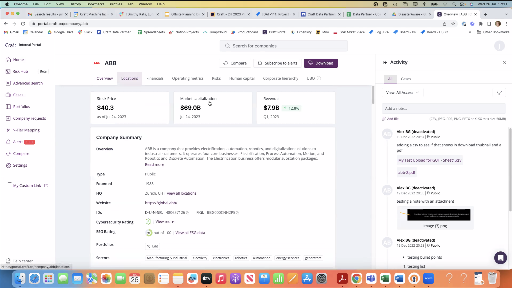
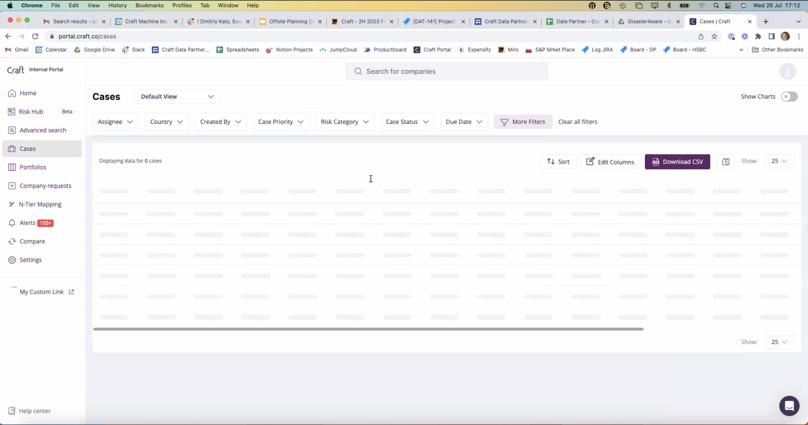
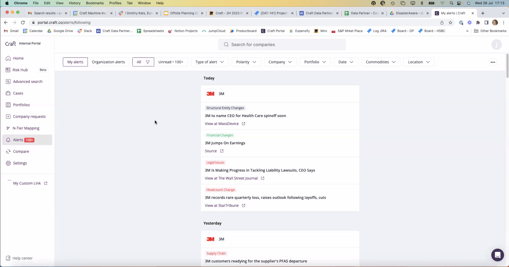

# Craft.co Meeting 7/26/23

- Looking to us as Data Partner
- Julie Lemmon - Data Partnerships - Lead
- Rosanna Marcua - Partnerships team
- Sara Beck - Head of Data Science
  - Alerts product
  - Events and how to mitigate
- James Miller - Product Manager
  - Works for Ashley
- Ashley Aruffo - Product Team
- Send over API docs, and hazardification spreadsheets for natural and man-made hazards
- Suggested they sign up for trial to review the data

  - Interested in data side, and surface for their clients

  - 
  - 
  - 
