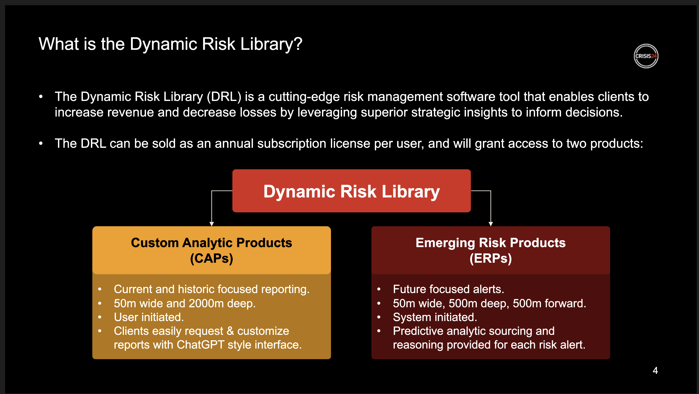
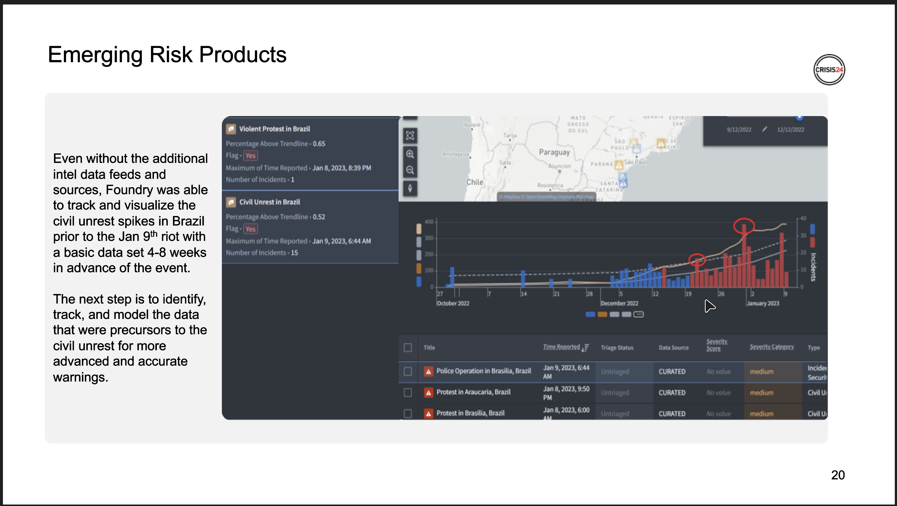
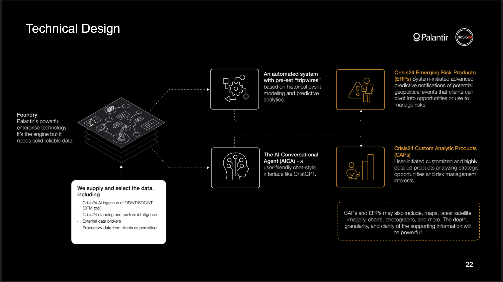
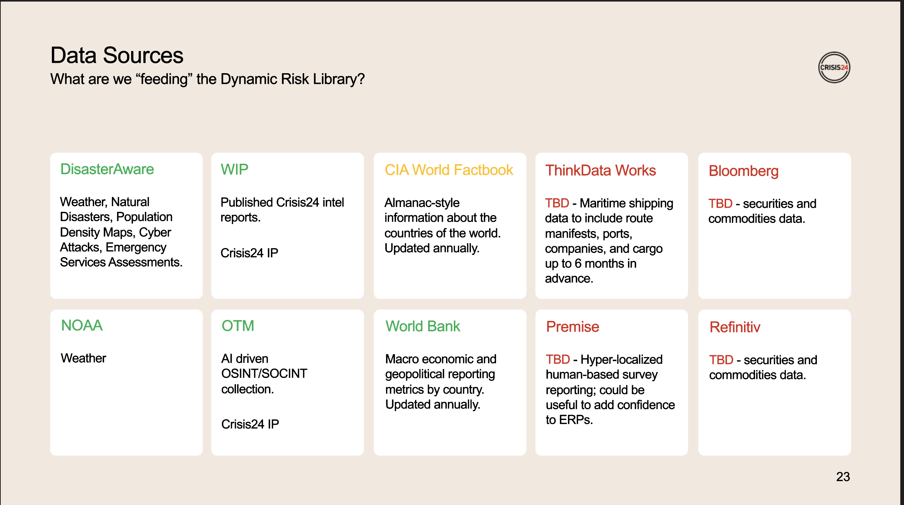
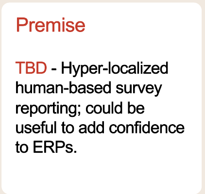

# Crisis24 / Chad Lesch / Call on 6/7/23

- First 6 months steering committee meeting - successful
- John Michel / Chad's boss / 2nd in command and GuardaWorld
- Alex Carp / Palantir #2
- Chad is authorized to sign the PO for the POC
- Sounds like it won't block to get moving on the POC
- They want to pay for data, they want to own the data
- Different cultural approach to how "they" think about paying for data
- Get us PO and we will get started on the POC
- Dynamic Risk Library is the name of the product
- Palantir gets 15% of the cost rigth out of the gate
- Other data streams are flat fee (80-120k was mentioned)
- Targeting folks "So What" and "Now What" reaction to events
- Palladium (catalytic converter) and neon gas (silicon lasers) coming out of Ukraine
  - impact to the world
  - opportunities to make $
- North Korean Missle launch immeditately impacts the Yuan in China within 96 hours
- In the business to help western businesses to make $
- Channel/sales strategy is unclear - outside the normal rolodex
  - Hedge fund, business developments, ... revenue centers
- They have global maritime data 6 months in advance of all shipping/manifests/ports/...

# Crisis24 / Topo1 Project / Mike Gilbert / Update on 6/7/23

- Got the list below previously
- Security centers - common operating picture
- See their assets, and threats to assets
- Topo1
- Always looking for more data to add to their platform
- Currently has 15 customers, looking to hit 30 by the end of the year
- Acquired by Crisis24 in January

  - Being sold by the Crisis24 sales team

- Got list of layers Mike is interested in, Michelle will work on the pricing
  - Population Density
  - Earthquake Intensity Zones
  - Historical Earthquakes
  - Historical Cyclone Tracks
  - Historical Tsunami Events
  - Historical Tsunami Run-Up
  - Historical Large Fires
  - Volcano Density
  - Volcano Locations
  - Historic Volcanic Eruptions
  - Global Flood Incidents
  - CDC Travel Notices
  - Department of State Travel Advisories
  - Shipping Lanes Zones (USA)
  - US National Park Service Boundaries (USA)
  - Federal and Indian Lands (USA)
  - Military Installation Boundaries (USA)
- Several integrations in the product determine the pricing
- Some are included in the base (they eat the cost)
- He's like it to be "out of the box", everyone gets it
  - Will depend on pricing
- 200 users currently

# Engagement with Palantir/Crisis24

- Wants to do a deeper dive
- They work with Crisis24
- Will demo their application
- Use cases unclear?

# Call with Chad on 4/13/23

- Showing a demo / presentation deck
- Chad was in the CIA for a couple decades
- "Dynamic Risk Library" - SW tool to enable clients to increase revenue (decrease losses), to yield strategic insights
- Sold as annual subscription license per user
- Custom Analytic Products (current and historic) - user initiated
  - Will plan to use GPT-4 but trained with different data
- Emerging Risk Products (future focused) - system initiated
- Going to include Bloomberg Data
- And CIA Playbook
- Meritime Shipping Data
- Target expense officer in a company
  - Less that 1% of the comapny is focused on this
  - How can they move into the revenue centers?
- Bridging geopolitical risk and impact to revenue
- Wants user license, $12k/person is target the license (no password sharing)
  - This is 1/2 a Bloomberg terminal
- Suggesting a % of their price in order to allow it to grow as they raise prices in the future
- They would be willing to reduce the data needs to get better pricing
- Wants to price low initially to get the seats out there
- Looking to porting out some features/products into other products they have
- Layered and upsell opportunity
- Q124 release target
  - Finalize initial data feeds is critical to get done quickly
- Completely open to "attribution" in the product
- Wants to get to 30k licenses
- Cost target $1M for all data sources (for the 30k) for 30k users \* 12k/user = $360M
- 3 year target for 30k users - 10k users first year
- Large # of seats in big companies, direct sales focused and contacts
  - Maybe use telesales, or other models to get individuals/smaller number of seats
- Screenshots from call:
  - 
  - 
  - 
  - 
  - 

## Palanir/Crisis24 SOW

- Desired Layers

  - Population Density
    - https://agsc.pdc.org/geowebcache/service/wms (LAYERS=pop_dens_2015)
  - Earthquake Locations and Magnitutude
    - https://apps.pdc.org/msf/rest/services/global/pdc_active_hazards/Mapserver (6: Recent_Earthquakes)
  - Earthquake Intensity Zones
    - https://org-disasteralert.pdc.org/msf/rest/services/global/pdc_hazard_zones/MapServer (9: Earthquake Intensity Zones)
  - ## Shaking Intensity (ShakeMap Model)
  - Tectonic Plate Boundaries
    - https://org-disasteralert.pdc.org/msf/rest/services/global/pdc_hazard_zones/MapServer (6: Tectonic Plate Boundaries)

- Need to configure mappings to 4 servers:
  - https://agsc.pdc.org/geowebcache/service/wms with query param "LAYERS=pop_dens_2015)
  - https://apps.pdc.org/msf/rest/services/global/pdc_active_hazards/Mapserver (id: 6)
  - https://org-disasteralert.pdc.org/msf/rest/services/global/pdc_hazard_zones/MapServer (id: 6 and 9)
  - https://apps.pdc.org/msf/rest/services/global/pdc_models/MapServer (id: 6)

## Meeting with Crisis/Palantir - 4/7/23

- Chad Lesch
- Mike Gilbert / Topo1 platform engineer
- Thomas Lee / CTO of Topo1 by Crisis24 Platform
- Steve D'Adamo / Crisis24 - Horizon
- Cathy Gill / Crisis24 - Horizon

- Vik Trivikram
- Ismail Seyfi / IT

- Topo1
  - CEM space
  - Understand assets an organization has and threats
  - Natural disasters/weather events/...
  - Got interested based on Chad's poking
  - Mike Gilbert - question around the data sources
    - Asking how we sell data and in what different bundles

## Meeting with Crisis24/Palantir

- Chad Lesch - Crisis24
- Zach Romanow - Palantir
- Trivikram "Vik" Pathak

- Meandering discussion
- Zach has had access to PDC data via Ray for over 6 months now (from PDC tier)
- Very interested in historical data
  - Custom reports
  - Some layer Data
  - Population density/exposure/hazard brief data
- Interested in "Predictive Model" and "Estimated Import"
- Curious about coverage in other paths of the world
  - Mention Iran and Syria as two examples
- Recommended they get SaaS trial, and then get demo from Johnny to allow them to best review the available data

- Chad handed over to Matt Bradley (used to be at OnSolve)
